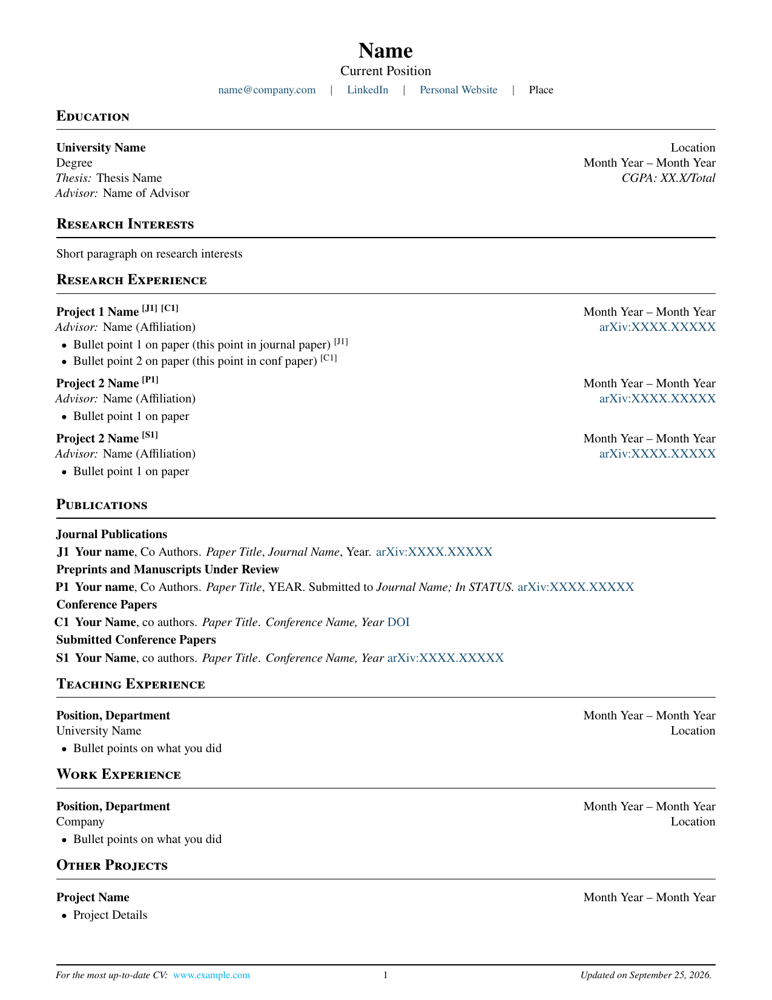

# Research CV — LaTeX Template

A clean, single-file LaTeX template for an academic CV, built for researchers and graduate-school applicants. It numbers your publications by type (J1, P1, C1, S1…) and lets you cite them from anywhere in the CV with clickable superscript tags, so a reader can go straight from a research project to the paper it produced.

<p align="center">
  
</p>

---

## Table of Contents

- [Features](#features)
- [Quick Start](#quick-start)
- [Building the PDF](#building-the-pdf)
- [Document Structure](#document-structure)
- [Publications & Cross-References](#publications--cross-references)
- [Custom Commands Reference](#custom-commands-reference)
- [Customization](#customization)
- [Troubleshooting](#troubleshooting)
- [Requirements](#requirements)
- [License](#license)

---

## Features

- **Self-numbering publications.** Four separate counters cover journal papers (`J`), preprints (`P`), conference papers (`C`) and submitted conference papers (`S`). If you add, remove or reorder entries, the numbers update on the next build.
- **Clickable cross-references.** Tag a research project or a single bullet with `\pubref{...}` and it renders as a superscript like <sup>[J1]</sup> that links to the entry.
- **Compact, readable layout.** Tight margins, Times-style typography (`newtxtext`/`newtxmath`), `microtype` spacing, and small-caps section headings with rules underneath.
- **Useful footer.** A link to your online CV on the left, the page number in the middle, and an "Updated on \<date\>" stamp that fills itself in on every build.
- **One file, no custom class.** Everything is in `template.tex`, and it builds with standard TeX Live / MacTeX / MiKTeX packages. Overleaf works too.

---

## Quick Start

```bash
git clone https://github.com/mahadevxo/academic-cv.git
cd academic-cv
cp template.tex cv.tex        # keep the original template as a reference
latexmk -pdf cv.tex           # builds cv.pdf
```

Then open `cv.tex` and replace the placeholder text (`Name`, `University Name`, `Month Year`, `arXiv:XXXX.XXXXX` and so on) with your own details.

**Overleaf:** create a *Blank Project*, upload `template.tex`, and set the compiler to **pdfLaTeX** (*Menu → Compiler*).

---

## Building the PDF

The recommended way is `latexmk`, which runs LaTeX as many times as it takes to resolve the cross-references:

```bash
latexmk -pdf template.tex
```

To keep build files out of the repo folder:

```bash
latexmk -pdf -outdir=build template.tex
```

To clean up auxiliary files:

```bash
latexmk -c        # keeps the PDF
latexmk -C        # removes the PDF too
```

If you run plain `pdflatex`, run it **twice**:

```bash
pdflatex template.tex
pdflatex template.tex
```

On the first pass the `\pubref` labels haven't been written yet, so they show up as **`[??]`**. The second pass fills them in.

> The included `.gitignore` already ignores LaTeX build files (`*.aux`, `*.log`, `*.out`, `*.fls`, `*.fdb_latexmk`, …).

---

## Document Structure

The template has these sections, in order. You can delete, reorder or rename any of them; each one is just a `\section*{...}` block.

| Section | What goes there |
|---|---|
| **Header** | Name, current position, email, LinkedIn, personal website, location |
| **Education** | University, degree, dates, thesis title, CGPA, advisor |
| **Research Interests** | A short justified paragraph |
| **Research Experience** | Projects with dates, advisor, arXiv link, bullets, and `\pubref` tags |
| **Publications** | Journal papers, preprints / under review, conference papers, submitted conference papers |
| **Teaching Experience** | TA or instructor roles |
| **Work Experience** | Industry or other positions |
| **Other Projects** | Side projects, open-source work, and so on |

---

## Publications & Cross-References

This is the main feature of the template. Every publication gets a **label** when you add it, and you can **cite** it anywhere else in the CV.

### 1. Add a publication

Each category has its own `enumerate` list and its own item command:

```latex
\textbf{Journal Publications}
\begin{enumerate}
    \journalitem{paper:journal:paper1}
    \textbf{Your Name}, Co Authors.
    \textit{Paper Title},
    \textit{Journal Name}, 2025.
    \href{https://arxiv.org/abs/XXXX.XXXXX}{arXiv:XXXX.XXXXX}
\end{enumerate}
```

| Command | Prefix | Use for |
|---|---|---|
| `\journalitem{label}` | **J** | Published journal articles |
| `\preprintitem{label}` | **P** | Preprints and manuscripts under review |
| `\conferenceitem{label}` | **C** | Published conference papers |
| `\subconfitem{label}` | **S** | Submitted conference papers |

The label can be any unique string. The template uses `paper:<type>:<name>`, which is easy to read, but nothing depends on that format.

### 2. Cite it

Put `\pubref{label}` wherever you want the tag to appear, for example in a project heading or a bullet:

```latex
\cvheading{Neural Widget Compression
    \pubref{paper:journal:paper1} \pubref{paper:conf:paper1}
}{Jan 2024 -- Present}

\begin{itemize}
    \item Proposed a new widget quantizer \pubref{paper:journal:paper1}
\end{itemize}
```

This renders as **Neural Widget Compression** <sup>[J1] [C1]</sup>, and each tag links to its entry in the Publications section.

### 3. Moving a paper between categories

When a submitted paper is accepted, move its entry to the right list and change the item command, e.g. `\subconfitem` → `\conferenceitem`. **Keep the label the same.** Every `\pubref` that points to it will change from `[S1]` to `[C…]` on the next build, and you don't need to edit anything else.

---

## Custom Commands Reference

| Command | Arguments | Output |
|---|---|---|
| `\cvheading{left}{right}` | Bold title, right-aligned text | A bold heading line with right-aligned text (usually dates or location) |
| `\cvsubheading{left}{right}` | Italic text, right-aligned text | An italic sub-line with right-aligned text |
| `\cvproject{text}` | Project description | *Project:* text |
| `\cvpreprint{url}` | arXiv URL | *Preprint:* [arXiv](#) |
| `\pubref{label}` | Publication label | Linked superscript tag, e.g. <sup>[C2]</sup> |
| `\entryspace` | — | Small vertical gap between entries |
| `\mediumsize` | — | 11pt font size switch (used for the position line under your name) |

`\cvsubheading`, `\cvproject` and `\cvpreprint` are defined but not used in the sample content. They're there if you need them.

---

## Customization

### Footer link

Set your CV's public URL in the footer. The first argument of `\href` is the link target and the second is the text that's shown:

```latex
\fancyfoot[L]{%
    \footnotesize
    \textit{For the most up-to-date CV: }
    \href{https://your-site.com/cv.pdf}{your-site.com/cv}
}
```

> ⚠️ In the template the link target is the placeholder `cv link`, which isn't a valid URL. Replace it before you share the PDF.

### Colors

```latex
\definecolor{linkblue}{HTML}{1A5276}   % hyperlinks
\definecolor{darkgray}{HTML}{333333}   % header separators
```

### Margins and paper size

The margins are set through `geometry` at the top of the file. For A4, change the class option:

```latex
\documentclass[10pt,a4paper]{letter}
```

### Font

The template uses Times-style fonts via `newtxtext`/`newtxmath`. To switch, replace that line with, for example:

```latex
\usepackage{libertinus}        % Libertinus Serif
% or
\usepackage[sfdefault]{roboto} % Roboto (sans-serif)
```

### Section heading style

Section headings are set with `titlesec`:

```latex
\titleformat{\section}
{\large\bfseries\scshape}   % font
{}{0pt}{}
[\vspace{-0.55em}\rule{\textwidth}{0.7pt}]   % rule below
```

### List spacing

Bullet and numbered list spacing is controlled by the two `\setlist` blocks under **LIST FORMATTING**. Adjust `itemsep` and `topsep` to make the CV tighter or looser.

---

## Troubleshooting

| Problem | Cause / Fix |
|---|---|
| `\pubref` shows **`[??]`** | The references aren't resolved yet. Run `pdflatex` a second time, or use `latexmk`. |
| `Package titlesec Warning: Non standard sectioning command \section` | Harmless. The template is built on the `letter` class, which has no native `\section`, and `titlesec` defines it. The output is unaffected. |
| `LaTeX Warning: Label ... multiply defined` | Two publications have the same label. Every `\journalitem{…}` / `\preprintitem{…}` / etc. needs a unique label. |
| `Reference ... undefined` | A `\pubref{label}` points to a label that doesn't exist. Check for typos, or a paper that was deleted. |
| `! LaTeX Error: File 'newtxtext.sty' not found` | Your TeX distribution is missing a package. See [Requirements](#requirements). |
| Footer link goes nowhere | Replace the `cv link` placeholder in `\fancyfoot[L]`. See [Footer link](#footer-link). |

---

## Requirements

- A LaTeX distribution: [TeX Live](https://tug.org/texlive/), [MacTeX](https://tug.org/mactex/) or [MiKTeX](https://miktex.org/). Or use [Overleaf](https://www.overleaf.com/), which needs no install.
- Compiler: **pdfLaTeX** (the default).
- Packages (all included in full TeX Live / MacTeX installs):

  `geometry` · `newtx` · `enumitem` · `titlesec` · `fancyhdr` · `xcolor` · `hyperref` · `microtype` · `ragged2e` · `array`

With a minimal install (e.g. BasicTeX), add the missing packages with:

```bash
sudo tlmgr install newtx enumitem titlesec fancyhdr microtype ragged2e
```

---

## License

Released under the [MIT License](LICENSE). You're free to use, modify and share this template, including for your own CV. The CV you produce with it is yours, and it doesn't need to include the license notice.
